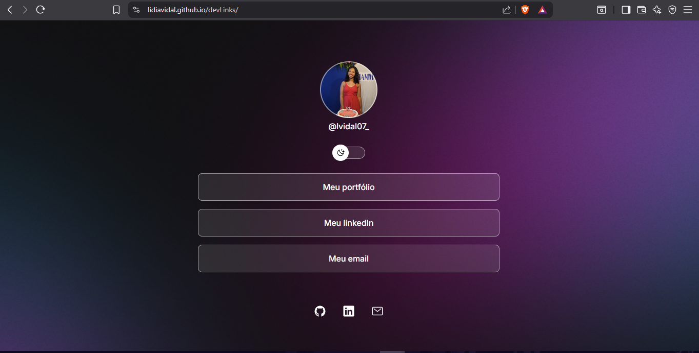

# devLinks 🚀



> Trilha Discover - Rocketseat

`devLinks` é um agregador de links para usar como um cartão de visitas online. Este projeto foi desenvolvido durante a trilha Discover da [Rocketseat](https://www.rocketseat.com.br/), um curso intensivo que aborda os fundamentos de HTML, CSS e JavaScript.

[🔗 Clique aqui para acessar o projeto](https://lidiavidal.github.io/devLinks/)

## 📖 Sobre o Projeto

O objetivo do `devLinks` é consolidar links importantes (portfólio, redes sociais, contato) em uma única página com uma interface simples e agradável. O projeto também inclui uma funcionalidade de troca de tema (claro/escuro), que persiste de acordo com a preferência do usuário.

## 🎨 Layout

O layout foi projetado para ser responsivo e se adaptar tanto a telas de desktop quanto de dispositivos móveis. Abaixo estão as prévias de como a aplicação se parece em ambos os modos.

#### Desktop


#### Mobile


## ✨ Funcionalidades

- **Agregação de Links:** Centraliza todos os seus links importantes em um só lugar.
- **Alternância de Tema (Light/Dark Mode):** Permite que o usuário alterne entre o modo claro e o modo escuro.
- **Persistência do Tema:** A escolha de tema do usuário é salva no navegador (`localStorage`) e é mantida em visitas futuras.
- **Design Responsivo:** A interface se adapta perfeitamente a diferentes tamanhos de tela.

## 🛠️ Tecnologias Utilizadas

Este projeto foi construído utilizando as seguintes tecnologias:

- **HTML5:** Para a estrutura e semântica da página.
- **CSS3:** Para a estilização, layout (Flexbox) e animações.
- **JavaScript:** Para a lógica de programação, manipulação do DOM e a funcionalidade de troca de tema.

## 🚀 Como Executar o Projeto

Como este é um projeto front-end simples, não há necessidade de um passo de build. Você pode simplesmente clonar o repositório e abrir o arquivo `index.html` no seu navegador.

```bash
# Clone este repositório
$ git clone [https://github.com/lidiavidal/devLinks.git](https://github.com/lidiavidal/devLinks.git)

# Acesse a pasta do projeto
$ cd devLinks

# Abra o index.html no seu navegador
```

## 🤝 Como Contribuir

Este é um projeto de estudo, mas contribuições são bem-vindas! Se você tiver sugestões para melhorá-lo, siga os passos abaixo:

1.  Faça um **Fork** do projeto.
2.  Crie uma nova branch com as suas alterações: `git checkout -b my-feature`
3.  Salve as alterações e crie uma mensagem de commit contando o que você fez: `git commit -m "feature: My new feature"`
4.  Envie as suas alterações: `git push origin my-feature`
5.  Abra um **Pull Request**.

## 📄 Licença

Este projeto está sob a licença MIT. Veja o arquivo [LICENSE](LICENSE) para mais detalhes.

---

Feito com ❤️ por **Lídia Vidal**

[](https://www.linkedin.com/in/SEU-USUARIO-AQUI/)
[](https://github.com/lidiavidal)
